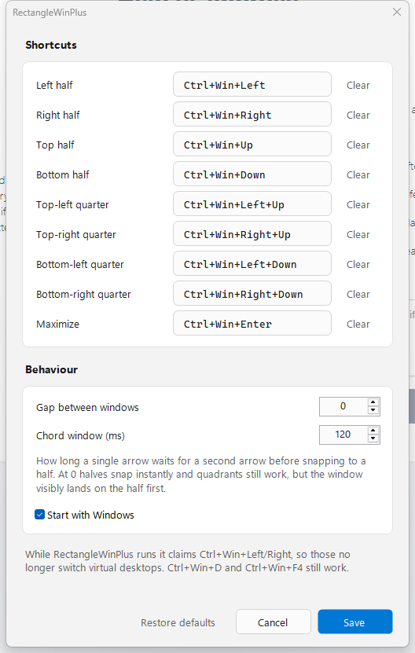

# RectangleWinPlus

Hotkey window snapping for Windows. Snap the focused window to a half, a quarter, or full screen
with chorded arrow shortcuts — and change any of them.

Inspired by [Rectangle](https://github.com/rxhanson/Rectangle) on macOS and
[RectangleWin](https://github.com/ahmetb/RectangleWin) on Windows. RectangleWin's own roadmap lists
configurable shortcuts as the one missing feature, with the author noting they'd probably never get
to it. That's the gap this fills.



## Download

Grab the latest build from **[Releases](../../releases)**.

- **`RectangleWinPlus-win-x64.exe`** — what most people want. One self-contained file: download it,
  run it, and it appears in your system tray. Nothing to install.
- **`RectangleWinPlus-win-arm64.exe`** — for Arm devices (Snapdragon X, Surface Pro X).
- **`…-framework-dependent.exe`** — a few hundred KB instead of ~47 MB, but requires the
  [.NET 10 Desktop Runtime](https://dotnet.microsoft.com/download/dotnet/10.0).

On first run, Windows SmartScreen warns about an unrecognized publisher, because the binaries are not
code-signed. Click **More info → Run anyway**, or check the SHA-256 against the `SHA256SUMS` file in
the release first.

## Shortcuts

| Shortcut | Action |
| --- | --- |
| `Ctrl+Win+Left` | Left half |
| `Ctrl+Win+Right` | Right half |
| `Ctrl+Win+Up` | Top half |
| `Ctrl+Win+Down` | Bottom half |
| `Ctrl+Win+Left`+`Up` | Top-left quarter |
| `Ctrl+Win+Right`+`Up` | Top-right quarter |
| `Ctrl+Win+Left`+`Down` | Bottom-left quarter |
| `Ctrl+Win+Right`+`Down` | Bottom-right quarter |
| `Ctrl+Win+Enter` | Maximize |

Quadrants are **chords**: hold `Ctrl+Win`, then press two arrows together. `Left` then `Up` gives you
the top-left corner. Every shortcut is rebindable.

Windows are snapped on whichever monitor they currently occupy, in that monitor's work area, so the
taskbar is never covered.

## How chords work

`Ctrl+Win+Left` and `Ctrl+Win+Left+Up` begin identically, so a lone arrow can't act the moment it
arrives. It waits out a short **chord window** (120 ms by default):

- A perpendicular arrow lands inside the window → the quadrant fires **immediately**, no waiting.
- The window closes with nothing else pressed → the half fires.
- `Ctrl+Win+Enter` fires instantly, because no longer shortcut can extend it.

Only the four half-screen shortcuts pay the 120 ms. If you press the second arrow *late* — after the
half already snapped — while still holding the first, the window still upgrades to the quadrant.

Set `chordWindowMs` to `0` and halves snap instantly; quadrants keep working, but you'll see the
window land on the half first.

## Configuration

Edit shortcuts in **Settings** (right-click the tray icon, or double-click it): click a shortcut,
press the keys you want, let go. `Esc` cancels.

Everything also lives in a JSON file, watched and hot-reloaded on save:

```
%APPDATA%\RectangleWinPlus\config.json
```

```json
{
  "gap": 0,
  "chordWindowMs": 120,
  "startWithWindows": false,
  "shortcuts": {
    "LeftHalf": "Ctrl+Win+Left",
    "RightHalf": "Ctrl+Win+Right",
    "TopHalf": "Ctrl+Win+Up",
    "BottomHalf": "Ctrl+Win+Down",
    "TopLeft": "Ctrl+Win+Left+Up",
    "TopRight": "Ctrl+Win+Right+Up",
    "BottomLeft": "Ctrl+Win+Left+Down",
    "BottomRight": "Ctrl+Win+Right+Down",
    "Maximize": "Ctrl+Win+Enter"
  }
}
```

Shortcut syntax is `Modifier+…+Key[+Key]`. Modifiers are `Ctrl`, `Alt`, `Shift`, `Win` (at least one
required). Keys are letters, digits, `F1`–`F24`, `Num0`–`Num9`, `Left`/`Right`/`Up`/`Down`, `Enter`,
`Esc`, `Space`, `Tab`, `Backspace`, `Delete`, `Insert`, `Home`, `End`, `PageUp`, `PageDown`. At most
two keys per shortcut. Set a shortcut to `""` to unbind it.

A broken config is never overwritten — the app logs what it couldn't read, shows a tray warning, and
falls back to defaults so you can fix the typo.

**`gap`** insets snapped windows, in pixels. Every visible gutter measures exactly `gap`, whether it's
against a screen edge or a seam two windows share.

## Trade-offs worth knowing

**Virtual desktop switching.** `Ctrl+Win+Left` and `Ctrl+Win+Right` are reserved by Windows for
switching virtual desktops, and `RegisterHotKey` will not hand them over. So this app runs a
`WH_KEYBOARD_LL` low-level keyboard hook — the same approach PowerToys uses — which sees keys before
the shell does. **While it runs, those two combos snap windows instead of switching desktops.**
`Ctrl+Win+D` (new desktop) and `Ctrl+Win+F4` (close desktop) still work, as does `Win+Tab`. Rebind
those two shortcuts if you'd rather keep desktop switching.

`Ctrl+Win+Enter` (Narrator) and `Ctrl+Win+M` (Magnifier) are claimed the same way.

**Windows running as administrator** can't be moved by a non-elevated process — Windows blocks it.
Run RectangleWinPlus as administrator too if you need to snap those. It says so once, in a tray
balloon, rather than failing silently.

**Antivirus.** Keyboard hooks are how keyloggers work, so some AV heuristically flags any program
that installs one. Nothing is recorded or transmitted; the hook body only inspects which keys are
down and swallows the ones you bound. See `HotkeyEngine.cs`.

## Build and run

Requires the [.NET 10 SDK](https://dotnet.microsoft.com/download).

```powershell
dotnet build RectangleWinPlus -c Release
.\RectangleWinPlus\bin\Release\net10.0-windows\RectangleWinPlus.exe
```

A single self-contained executable, as shipped in releases:

```powershell
dotnet publish RectangleWinPlus -c Release -r win-x64 --self-contained true `
  -p:PublishSingleFile=true -p:IncludeNativeLibrariesForSelfExtract=true -p:EnableCompressionInSingleFile=true
```

The app lives in the system tray. Right-click for Settings, config, log, autostart, and Exit.
Logs go to `%LOCALAPPDATA%\RectangleWinPlus\log.txt`.

`icon.ico` is generated from code by `tools/make-icon.ps1`; CI fails if the committed file no longer
matches its generator.

## Tests

```powershell
dotnet run --project RectangleWinPlus.SelfTest
```

**90 checks.** 68 need no desktop and run in CI: shortcut parsing, the gap and quadrant geometry
(including odd-width monitors and displays at negative coordinates), the chord state machine
(auto-repeat, impossible pairs like `Left+Right`, late second arrows, left/right modifier keys,
pass-through of unbound combos), and shortcut recording. The chord engine is driven through its real
decision procedure with a fake clock.

The remaining 22 snap a **live window in another process** and measure where it landed, at gap 0 and
gap 12, from maximized and from minimized. Pass `--no-live` to skip them, as CI does.

To drive the real running app with synthetic keystrokes:

```powershell
dotnet build RectangleWinPlus.SelfTest -c Debug
$app = ".\RectangleWinPlus\bin\Debug\net10.0-windows\RectangleWinPlus.exe"
.\RectangleWinPlus.SelfTest\bin\Debug\net10.0-windows\RectangleWinPlus.SelfTest.exe --e2e $app
```

It probes with an unreserved combo first, so if the hook isn't live it stops before sending
`Ctrl+Win+Left` and yanking your desktop sideways.

`--settings-shot <out.png>` renders the settings dialog to an image, which is how `docs/settings.png`
is produced.

## Design notes

**Why a keyboard hook rather than `RegisterHotKey`.** Two reasons, either sufficient. `RegisterHotKey`
binds exactly one key plus modifiers, so it cannot express `Ctrl+Win+Left+Up`. And it refuses combos
the shell already owns, which includes `Ctrl+Win+Left/Right`.

**The invisible border.** Modern windows carry an invisible resize border — roughly 7px at 100% DPI on
the left, right and bottom — so `GetWindowRect` returns a rectangle larger than what you see. Snap a
window to an exact quadrant and it looks *wrong*, floating a few pixels off two edges. The fix is to
ask DWM for `DWMWA_EXTENDED_FRAME_BOUNDS`, diff it against `GetWindowRect`, and inflate the target by
that delta. It's why snapped windows here sit flush against each other and the screen.

**DPI.** The process is per-monitor-v2 aware, which keeps `GetWindowRect`, `SetWindowPos` and
`GetMonitorInfo` in one shared physical-pixel space. Without it, Windows virtualizes coordinates and
the math quietly breaks on mixed-DPI setups.

**Hook latency.** Windows evicts a low-level hook whose callback overruns `LowLevelHooksTimeout`
(300 ms). The callback here only mutates a few sets; the actual `SetWindowPos`, which can block on a
foreign window's message loop, is posted to the UI thread and runs after the callback returns.

## Not implemented

Thirds and sixths, cycling on repeated presses (`½ → ⅔ → ⅓`), drag-to-edge snap areas, move-to-next-
display, per-app ignore lists. Rectangle on macOS has all of these.

## License

MIT — see [LICENSE](LICENSE).
